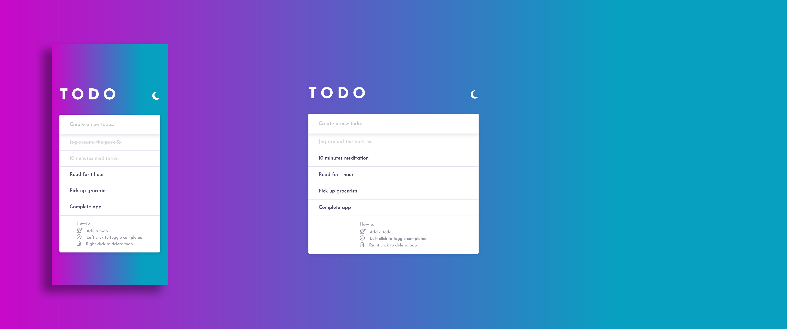
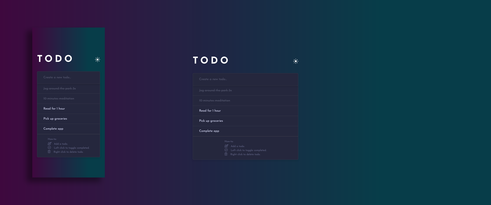

# Todo app

Users should be able to:

- View the optimal layout for the app depending on their device's screen size
- See hover states for all interactive elements on the page
- Add new todos to the list
- Mark todos as complete
- Delete todos from the list
- Toggle light and dark mode

## Table of contents

- [Screenshot](#screenshot)
- [Links](#links)
- [Built with](#built-with)

### Screenshot

### Links

- [Live Site URL](https://rosalialey.github.io/todo-app/)

### Built with

- Semantic HTML5 markup
- CSS custom properties
- Flexbox
- JavaScript
- JSON
